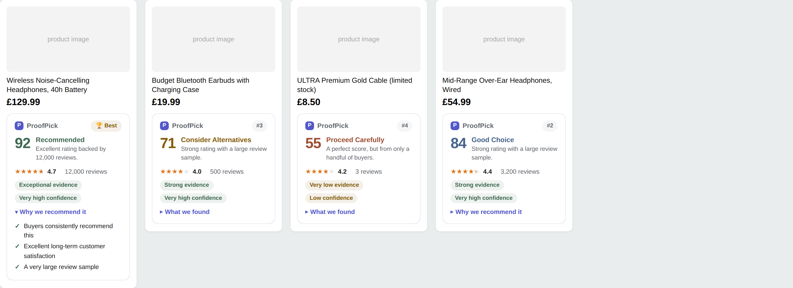
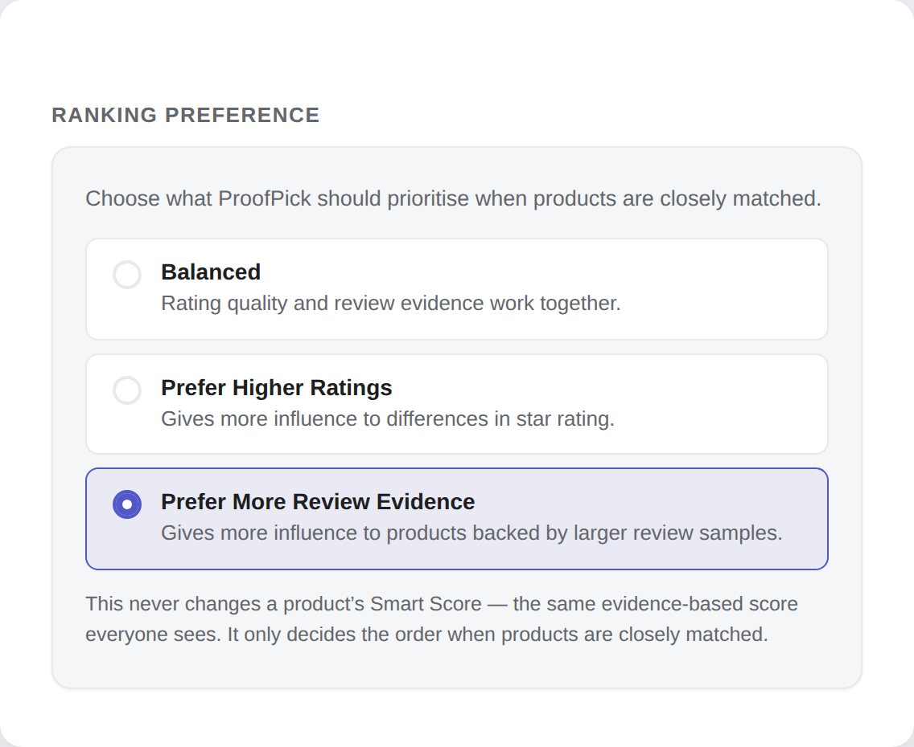
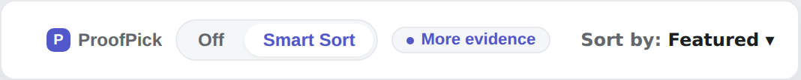
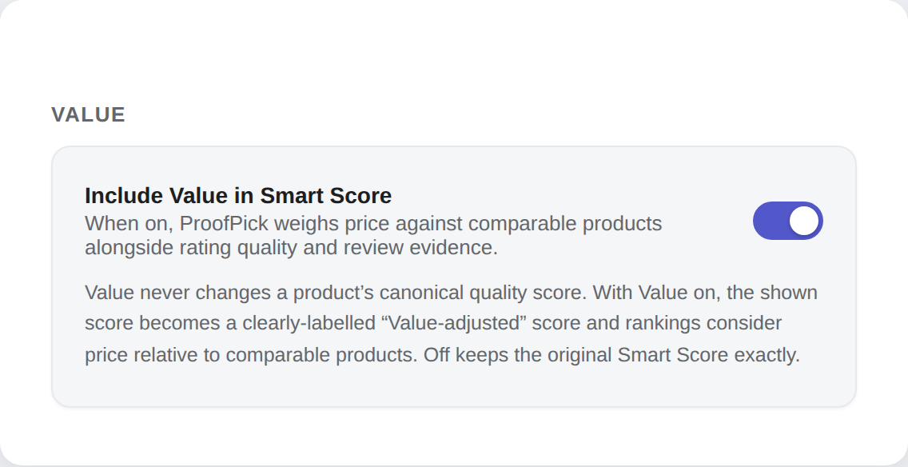
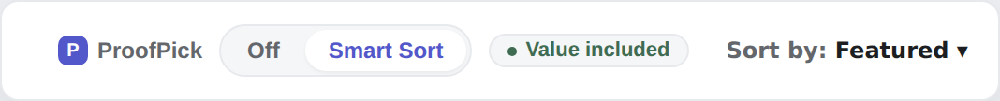
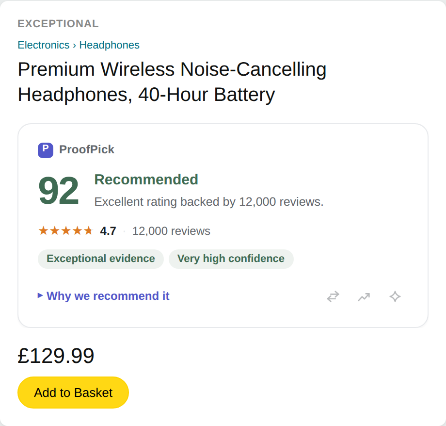
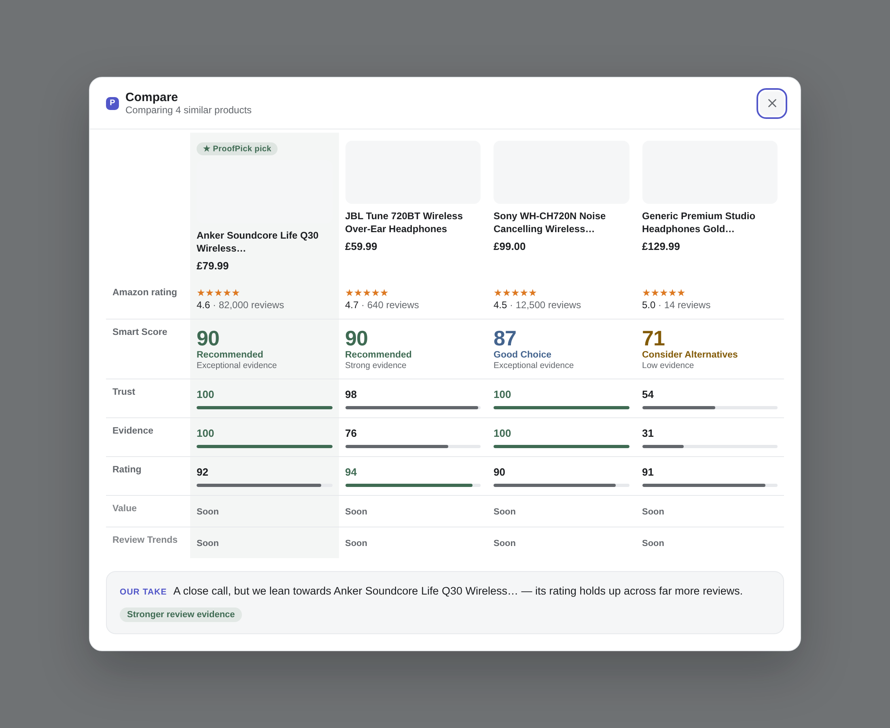

# ProofPick

**Shop smarter. Buy with confidence.**

*A trust‑weighted “Smart Score” for Amazon — shop by proof, not hype.*

A `5.0` from 3 reviews looks better than a `4.6` from 4,000 — but it isn’t. ProofPick
is a Manifest V3 browser extension that reads every product’s rating **and how much
evidence backs it**, then shows a single, transparent Smart Score (0–100) with the
reasons behind it — right on the Amazon page, as you shop. No hype, no black box,
and nothing about you leaves your browser.

Product images and prices above are placeholders in a demo layout — the extension renders these badges on the real store page.

---

  
  
  
  
  
  
  

> **Note on this repository.** This is the public showcase for ProofPick. The
> source code is kept private while the product is prepared for release; this repo
> is the home for its product overview, screenshots, privacy summary, and feedback.
> Engineers/reviewers who’d like a deeper look or a code walkthrough are welcome to
> [open an issue](https://github.com/naelhiqbal-lang/proofpick-public/issues/new).

---

## What it does

- **Smart Score on every product** — a 0–100 score on each search result and product
  page that weights the star rating by how much review evidence stands behind it.
- **Transparent reasons, never a black box** — every score expands into plain‑English
  “why”, plus evidence and confidence chips. A perfect rating from a handful of buyers
  is called out, not celebrated.
- **Smart Sort** — reorder search results by real evidence with one toggle. Its control
  lives right in Amazon’s results toolbar and **stays put when you apply Amazon’s own
  filters** (price, Prime, brand, rating…) instead of disappearing on a refresh.
- **Sponsored results are excluded, not ranked** — advertisements are never scored, never
  badged, never given a ProofPick rank, and never mixed into the merit ranking or
  comparisons. A recommendation has to be earned. By default ProofPick also **hides
  sponsored placements entirely** (a one-time notice explains this, and one switch in
  Settings shows them again) — so out of the box, every product you see is one ProofPick
  can analyse.
- **Ranking preference** — a simple choice of what ProofPick should prioritise when
  products are closely matched: **Balanced** (the default), **Prefer Higher Ratings**, or
  **Prefer More Review Evidence**. It tunes the *order* — Smart Sort, comparisons, the
  recommended pick — and **never changes the Smart Score everyone sees**. When your
  preference decides a close call, ProofPick says so plainly.

- **Value — quality for the price** *(a standard Smart Score component, on by default and
  individually switchable)* — a 0–100 read on how much review‑backed quality a product
  delivers for its price, measured against a **stable reference cohort** of comparable
  products (same kind of product, same currency, sponsored slots excluded). The same
  product shows the same score on every surface; when Value can’t be measured, the
  remaining signals renormalise honestly instead of guessing. It **never equates “cheap”
  with “good”**: a poorly‑reviewed bargain stays poor, and an excellent product doesn’t
  lose its lead to a slightly cheaper rival.

- **Product trust panel** — a full breakdown on the product page, with a fractional
  star display and honest states when a rating is missing.

- **Recommended Alternatives** — one click on a product page and ProofPick ranks the
  strongest alternatives the listing already surfaces, side by side. The verdict comes
  first (“We found a stronger alternative”, with the winner’s evidence), the comparison
  table is the proof beneath it, and the winning product wears a small **ProofPick
  Pick** badge on its image. How the alternatives were found — and when the scores
  were computed — sits quietly at the bottom, where methodology belongs.

Product images and prices above are placeholders in a demo layout — the extension builds this comparison from the real product page.

- **Works wherever you shop on Amazon** — **23 marketplaces** (UK, US, CA, AU, IE, AE,
  SG, IN, DE, IT, ES, NL, BR, FR, SE, MX, JP, BE, PL, TR, SA, EG, ZA) with locale‑aware
  rating, number and currency parsing.
- **Speaks your language** — the entire ProofPick UI (badges, trust panel, comparison,
  settings) is available in **12 languages** (English, German, French, Spanish, Italian,
  Dutch, Polish, Swedish, Turkish, Portuguese, Arabic, Japanese), including full
  right‑to‑left support for Arabic. Amazon's own content is never translated — only
  ProofPick's. Changing language updates every open Amazon tab live, without a reload.
- **Sponsored placements hidden by default** — entire ad modules (campaign header, brand
  banner and all) are removed from search results, since ProofPick never analyses them
  anyway. A one‑time, fully localised notice explains the default on first use, and one
  switch in Settings brings the ads back. Ads are never scored either way; this only
  controls whether you still see them.
- **On the roadmap: ProofPick Pro** — a premium tier with deeper buying tools, such as
  AI review summaries (opt‑in, consent‑gated) and a Deal Score with price‑history
  context. Pro deepens ProofPick; the evidence‑based Smart Score stays free.

## How the Smart Score works

Star averages are noisy and easy to game. ProofPick treats each rating as *evidence*:

1. **Shrink toward a sensible prior.** With few reviews, the score is pulled toward a
   neutral baseline; as real reviews accumulate, it earns its way up. This is why a
   5.0 from 3 reviews scores below a 4.6 from thousands.
2. **Weight by statistical confidence.** A lower‑confidence bound on the rating means
   the score reflects how *sure* we can be, not just the raw average.
3. **Evidence keeps mattering.** Two products with the same rating don’t tie just
   because both are popular: more reviews keep counting (with diminishing returns),
   while a better rating always outranks a bigger crowd. Volume is confidence in the
   rating — never a popularity prize.
4. **Explain everything.** The score always comes with its reasons and an honest
   confidence level — and when there’s no rating, ProofPick says so instead of guessing.

The result is a number you can actually trust, built from transparent statistics —
not sentiment, not paid placement, not fabricated “authenticity” claims.

## Engineering highlights

- **Manifest V3, TypeScript (strict).** Fully type‑safe; a service worker with no DOM
  dependencies, verified to start cleanly in a real Chromium runtime.
- **Layered architecture with an enforced dependency direction** — a pure core, a
  retailer‑adapter pattern (adding a store is “add one adapter”), an isolated scoring
  engine, a browser‑seam platform layer, and four thin surfaces (popup, options,
  background, content).
- **On‑page UI in Shadow DOM** — every injected badge and panel is fully style‑isolated
  from the host page, and vice‑versa.
- **1,103 automated tests** across parsing, scoring, ranking, value, localisation, UI and safety — including
  property/grid and adversarial checks on the ranking math — plus a build‑integrity
  checker and real‑Chrome verification harnesses that load the packaged extension and
  assert the worker registers and no page script is ever disturbed.
- **Locked down by design** — a strict Content‑Security‑Policy, **no remote code, no
  `eval`**, and Smart Sort that only ever repositions validated product cards (it never
  clones, injects, or re‑executes a page’s scripts).
- **Least privilege** — only the `storage` and `activeTab` permissions; no browsing or
  purchase history, no analytics, no tracking.

## Tech stack

TypeScript · React (popup & options) · Vite + CRXJS · Vitest · Shadow DOM · Chrome
Manifest V3 · Playwright (real‑Chrome verification).

## Privacy

ProofPick is **private by design**:

- **No personal data leaves your browser.** It reads the public product/rating markup
  already on the page to compute a score locally — that’s it.
- **No browsing or purchase history, no accounts, no analytics, no trackers, no ads,
  no affiliate links.**
- **No remote code, ever.** Everything runs from the extension’s own bundled files
  under a strict Content‑Security‑Policy.
- **Least privilege.** Only `storage` (to remember your settings) and `activeTab` (so
  the popup can read the current tab when you open it).

Optional, clearly‑gated future features (e.g. AI review summaries) are strictly
opt‑in and off by default — nothing is read or sent without an explicit switch.

## Chrome Web Store

ProofPick is being prepared for its first Chrome Web Store release. The listing will
lead with the same promise this page makes:

> **Shop smarter. Buy with confidence.**
> A 5.0 from 3 reviews isn't better than a 4.6 from 4,000. ProofPick scores Amazon
> products by evidence, not hype.

At a glance:

- 0–100 Smart Score on every search result and product page
- Four transparent signals: Trust · Evidence · Rating · Value
- "Why we recommend it" — plain‑language reasons, always
- Smart Sort, one‑click Compare, and the ProofPick Pick
- Sponsored placements never scored, never ranked — hidden by default (one switch shows them again)
- 23 Amazon marketplaces · 12 languages · full RTL support
- Private by design: no accounts, no tracking, no remote code, 2 permissions

*A store link will appear here on launch.*

## Status

Release candidate — feature‑complete, all quality gates green (1,103 automated tests,
real‑Chrome verification), preparing the Chrome Web Store submission. This repository
tracks the public product story; the implementation is private for now.

## Feedback

Found a bug, have an idea, or want a technical walkthrough?
**[Open an issue »](https://github.com/naelhiqbal-lang/proofpick-public/issues/new)**

---

ProofPick is an independent project and is not affiliated with, endorsed by, or
sponsored by Amazon. “Amazon” is a trademark of its respective owner.
